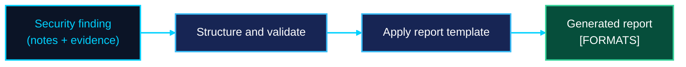

<h1 align="center">Security Report Generator</h1>

<p align="center">
  
</p>


<h1 align="center">Security Report Generator</h1>

<p align="center"><b>From raw findings to a report a triager can act on.</b><br/>
A lightweight tool that turns security findings into structured vulnerability reports with technical evidence, impact, reproduction steps and remediation.</p>


<p align="center">
  <a href="#why">Why</a> ·
  <a href="#features">Features</a> ·
  <a href="#installation">Installation</a> ·
  <a href="#usage">Usage</a> ·
  <a href="#report-structure">Report structure</a> ·
  <a href="#sample-report">Sample</a> ·
  <a href="#responsible-use">Responsible use</a>
</p>

---

## Why

A good finding can be rejected because the report is unclear. Triagers need the same things every time: what is wrong, where, how to reproduce it, what the impact is and how to fix it. Writing that from scratch for every finding is slow, and details get missed.

Security Report Generator gives each finding a consistent structure so researchers spend their time finding bugs, not formatting write-ups.

## Features

- **Structured reports** with a fixed, reviewer-friendly layout
- **Evidence-first:** attach requests, responses, code snippets and notes to each finding
- **Clear impact and reproduction steps** so triagers can verify quickly
- **Remediation guidance** included with every finding
- **[ADD / REMOVE]:** severity rating, CVSS, CWE mapping, multiple findings per report
- **Export formats:** [FORMATS, e.g. Markdown / HTML / PDF / JSON]

## Installation

```bash
git clone https://github.com/PYRAMID-SEC/Security-Report-Generator.git
cd Security-Report-Generator
[INSTALL COMMAND, e.g. pip install -r requirements.txt]
```

**Requirements:** [LANGUAGE AND VERSION]

## Usage

```bash
[COMMAND TO GENERATE A REPORT]
```

### Input

[Describe how findings are provided: a file, interactive prompts or a template. Show a short example of the input format.]

```[json/yaml]
[EXAMPLE INPUT]
```

### Options

| Option | Description |
|--------|-------------|
| `[FLAG]` | [WHAT IT DOES] |
| `[FLAG]` | [WHAT IT DOES] |

## Report structure

Every generated report follows the same layout:

| Section | What it contains |
|---------|------------------|
| **Title and severity** | A short, specific summary and a severity rating |
| **Summary** | One paragraph a triager can understand at a glance |
| **Affected asset** | The endpoint, component or version involved |
| **Technical evidence** | Requests, responses, logs, code or screenshots |
| **Steps to reproduce** | Numbered steps to confirm the issue |
| **Impact** | What an attacker can realistically do |
| **Remediation** | Concrete advice to fix the issue |
| **References** | [CWE, OWASP or vendor links, if supported] |



## Sample report

[Add a real sample here: a screenshot of the output, or a short excerpt of a generated report using fake or sanitized data. This section is the most convincing part of the README.]

## Project structure

```
[PASTE THE OUTPUT OF `tree -L 2` HERE]
```

## Responsible use

This tool formats findings. It does not find vulnerabilities or exploit anything. Use it only to document issues in systems you own or are authorized to test, and follow each program's disclosure rules.

- Remove real credentials, personal data and secrets from evidence before sharing a report.
- Report vulnerabilities to the affected owner through the proper channel.

## Roadmap

- [ ] [FEATURE]
- [ ] [FEATURE]
- [ ] [FEATURE]

## Author

**Ahmed Tarek Salah**, Cybersecurity Researcher, building at [PYRAMID-SEC](https://github.com/PYRAMID-SEC).
